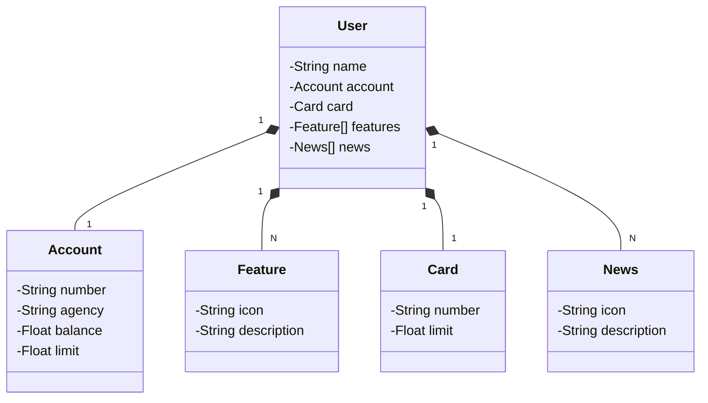

# Santander Dev Week
Java RESTful API criada para o Santader Dev Week.

## Diagrama de Classes.

```mermaid
classDiagram
  class User {
    -String name
    -Account account
    -Card card
    -Feature[] features
    -News[] news
  }
  
  class Account {
    -String number
    -String agency
    -Float balance
    -Float limit
  }
  
  class Feature {
    -String icon
    -String description
  }
  
  class Card {
    -String number
    -Float limit
  }
  
  class News {
    -String icon
    -String description
  }

  User "1"*-- "1"Account
  User "1" *-- "N" Feature
  User "1" *-- "1" Card
  User  "1" *-- "N" News
```
